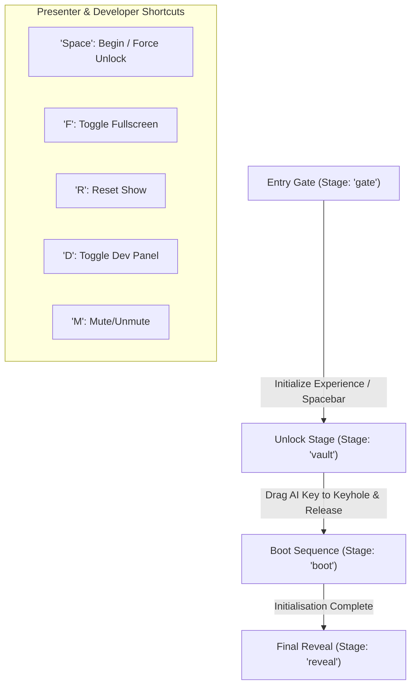
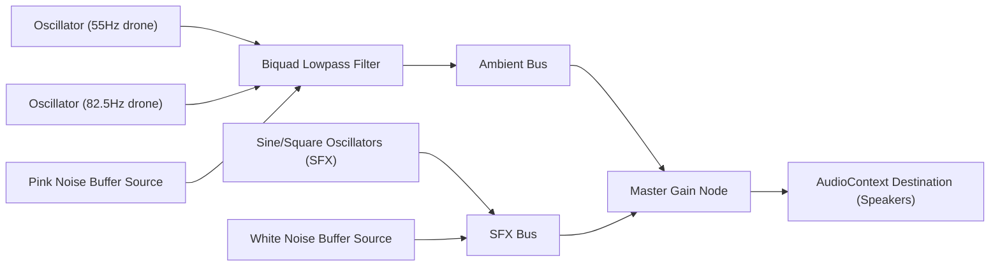

# Codebase Architecture - AI & ML Department Inauguration Experience

This document details the architecture, design patterns, and implementation specifics of the **Cinematic Inauguration Experience** for the Department of Artificial Intelligence & Machine Learning. 

---

## 1. Executive Summary & Design Goals

The application is a cinematic, web-based presentation tool designed to run fullscreen on a projector or large screen during an official department launch ceremony. The audience is taken on an interactive narrative from a locked vault to a full system boot-up, concluding with a dramatic reveal of the department's emblem and branding.

### Core Architectural Decisions:
* **Zero Network Latency:** High-fidelity animations are rendered in real-time using Canvas API and GSAP. Sound effects are synthesized on-the-fly via the Web Audio API rather than loading external audio files. This makes the application immune to buffering or poor Wi-Fi connectivity at the venue.
* **Declarative State, Imperative Render:** Narrative state is managed declaratively by a core React hook (`useInauguration`), while high-performance graphics (canvas backdrops, particle explosions, GSAP transforms) are handled imperatively to hit 60 FPS consistently.
* **Robust SSR Wrapper:** The application utilizes TanStack Start. Unhandled server-side rendering (SSR) failures are caught and formatted prior to serialization, ensuring a clean error screen instead of standard HTTP page crashes.

---

## 2. Directory Structure

```
├── .lovable/                 # Metadata and workspace configurations
├── public/                   # Static browser assets (e.g. favicon)
└── src/
    ├── assets/               # Branding images (emblem, college crest)
    ├── components/
    │   └── inauguration/     # Act components, canvas renderers, and UI layers
    ├── hooks/                # Global states (narrative flow & mobile state)
    ├── lib/                  # Web Audio synthesizer, error capture & reporting
    ├── routes/               # TanStack Start file-based routing
    ├── router.tsx            # TanStack Router configuration
    ├── server.ts             # Custom SSR web entry wrapper
    ├── start.ts              # TanStack Start configurations (CSRF & middleware)
    └── styles.css            # Tailwind CSS v4 design tokens and global layout
```

---

## 3. Cinematic Narrative State Machine

The entire ceremony is structured as a state machine with four sequential **Stages** (Acts). Transitioning between acts is managed by the [useInauguration](file:///g:/Chrome%20Dowmloads%20Naye%20Wale/lovable-project-fb333d0f/src/hooks/useInauguration.ts) hook.



### Act 0: The Entry Gate (`gate`)
* **File:** [EntryGate.tsx](file:///g:/Chrome%20Dowmloads%20Naye%20Wale/lovable-project-fb333d0f/src/components/inauguration/EntryGate.tsx)
* **Purpose:** Browsers require a user gesture (such as clicking a button or pressing space) before starting Web Audio contexts or requesting fullscreen. The Entry Gate serves as a cinematic title card instructing the presenter to check house audio before initiating the sequence.

### Act I: The Secure Vault (`vault`)
* **File:** [UnlockStage.tsx](file:///g:/Chrome%20Dowmloads%20Naye%20Wale/lovable-project-fb333d0f/src/components/inauguration/UnlockStage.tsx)
* **Purpose:** Displays a large mechanical vault door lock. The presenter drags the holographic [AIKey](file:///g:/Chrome%20Dowmloads%20Naye%20Wale/lovable-project-fb333d0f/src/components/inauguration/AIKey.tsx) toward the keyhole at the center of the [VaultLock](file:///g:/Chrome%20Dowmloads%20Naye%20Wale/lovable-project-fb333d0f/src/components/inauguration/VaultLock.tsx) component.
* **Mechanics:** 
  * Computes Euclidean distance between key tip and keyhole.
  * Adjusts ambient sound intensity, visual bloom, and ticking frequency dynamically based on proximity.
  * If released within a threshold, triggers an aligned magnetic snap, automatic key insertion and 90° rotation, bolt retraction, camera shake, and screen flash.

### Act II: AI System Initialisation (`boot`)
* **File:** [BootSequence.tsx](file:///g:/Chrome%20Dowmloads%20Naye%20Wale/lovable-project-fb333d0f/src/components/inauguration/BootSequence.tsx)
* **Purpose:** Simulates an advanced operating system initialization. 
* **Mechanics:** Displays a scrollable terminal terminal output rendering log messages in real-time synced with synthetic typing sounds. Concurrently, progress meters for 6 core subsystems (Neural Engine, Vision Module, NLP, Data Intelligence, Innovation Hub, Research Core) load with a staggered layout driven by a unified GSAP timeline.

### Act III: The Final Reveal (`reveal`)
* **File:** [FinalReveal.tsx](file:///g:/Chrome%20Dowmloads%20Naye%20Wale/lovable-project-fb333d0f/src/components/inauguration/FinalReveal.tsx)
* **Purpose:** The emotional peak. Renders concentric spinning orbital rings, an energy pulse, the department emblem, the institute logo, and the Department of Artificial Intelligence & Machine Learning wordmark.
* **Mechanics:** Speaks the department activation message using the system's text-to-speech engine and initiates a slow breathing effect that keeps the emblem active post-ceremony.

---

## 4. Procedural Synthesis Audio Engine

To eliminate external media requests and latency, the [AudioEngine](file:///g:/Chrome%20Dowmloads%20Naye%20Wale/lovable-project-fb333d0f/src/lib/audio-engine.ts) uses a custom Web Audio graph. Sounds are synthesized using low-level oscillators, gain nodes, and filters.



### Synthetic Audio Recipe Breakdown:
1. **Low-frequency Drone (Room Atmosphere):** Combines three detuned oscillators (55Hz, 82.5Hz, 110Hz) routed through a low-pass filter (cutoff ~320Hz) mixed with a pink-noise generator. The engine morphs the frequency filter cutoff (up to 1400Hz) and detune range based on active stages (e.g. shifting to `charged` or `boot` stage).
2. **Proximity Indicators (Vault Approach):** Fires short triangle-wave blips. The pitch scales from 900Hz to 1800Hz and volume increases as the key is moved closer to the keyhole.
3. **Servo Motors (Key Rotation):** Couples a sawtooth wave (modulating between 70Hz and 190Hz) with a square-wave LFO running at 26Hz to simulate teeth shifting inside a mechanism.
4. **Cinematic Impact (Vault Opening):** Stacks a decaying low sine wave (92Hz down to 26Hz), a mid-frequency triangle wave, and a filtered white-noise burst.
5. **System Speech Announcement:** Leverages the native `SpeechSynthesis` Web API. It prioritizes system voices like `Samantha` or `Zira` (female synthesizers) to read announcements with adjusted speech rates and volume settings.

---

## 5. Interactive Graphics & Canvas Systems

To maintain a consistent 60 FPS, complex background animations and particulate effects bypass standard DOM rendering, leveraging standard HTML5 Canvas layers.

### The Ambient Grid (`AmbientBackground`)
* **File:** [AmbientBackground.tsx](file:///g:/Chrome%20Dowmloads%20Naye%20Wale/lovable-project-fb333d0f/src/components/inauguration/AmbientBackground.tsx)
* Uses a single continuous `requestAnimationFrame` loop that coordinates four visual layers:
  1. **Depth-Layered Stars:** Small floating particles scaled and slowed by depth factors ($z$-axis) to generate a parallax effect as the cursor moves.
  2. **Slow Spinning Hexagons:** An outer network of wireframe hexagons simulating high-tech structural grids.
  3. **Manhattan Routing Circuit Traces:** Randomly routed perpendicular electrical lines. An active tracer point periodically calculates coordinate points and emits glowing light sweeps along each route segment.
  4. **Dynamic Beams:** Broad diagonal light columns overlaying the grid to create shifting ambient glows.

### High-Fidelity Particles (`ParticleBurst`)
* **File:** [ParticleBurst.tsx](file:///g:/Chrome%20Dowmloads%20Naye%20Wale/lovable-project-fb333d0f/src/components/inauguration/ParticleBurst.tsx)
* Renders full-screen explosions. Initiating `burst()` projects hundreds of individual particles radially with random speeds and lifetimes. 
* To ensure realistic movement, a minute gravity pull ($y$-acceleration) is applied. Canvas blending is set to `lighter` for high-intensity glow overlaps.
* **Performance optimization:** The canvas loop automatically shuts down and clears resources when no active particles remain, saving CPU cycles between clicks.

---

## 6. Server-Side Rendering (SSR) & Error Architecture

The application is built on **TanStack Start**, which leverages a Nitro server wrapper. Standard web frameworks often hide server-side runtime errors behind a generic `500 Internal Server Error` response with all tracing removed. This codebase implements custom interceptors to preserve details.

### Error Workflow:
1. **Console Interceptor (`src/lib/error-capture.ts`):** Overrides `console.error` to intercept logged errors. It serializes cause chains up to 5 levels deep and stores the trace in temporary cache buffers.
2. **SSR Entry Interceptor (`src/server.ts`):** Intercepts outputs from TanStack Start's `server-entry`. If a status code of 500 or higher is detected containing Nitro's swallowed message markers (`HTTPError`), it retrieves the original exception out-of-band and renders a beautiful static error page (`src/lib/error-page.ts`).
3. **Client-Side Boundaries (`src/routes/__root.tsx`):** Renders a styled React boundary fallback on the browser if hydration or rendering fails, allowing presenters to reload or return home.

---

## 7. Presenter Control Dock

The control system is placed in the bottom-right corner, stylized with a HUD finish that floats above the content. Presenters can:
* Adjust/Mute synthetic audio levels.
* Manually skip ahead to subsequent acts if required during live testing.
* Press `D` to open the **Developer Panel** for hot-swapping stages during dress rehearsals.

### Hotkey Directory:
* `Spacebar` - Begins the show at the title card, or forces vault opening if stuck on Act I.
* `F` - Toggles full-screen view.
* `M` - Mutes or unmutes the audio engine.
* `R` - Performs a complete reset, clearing running timelines and reloading all states with a new unique run identifier (`runId`).
* `D` - Toggles the layout manager view.
